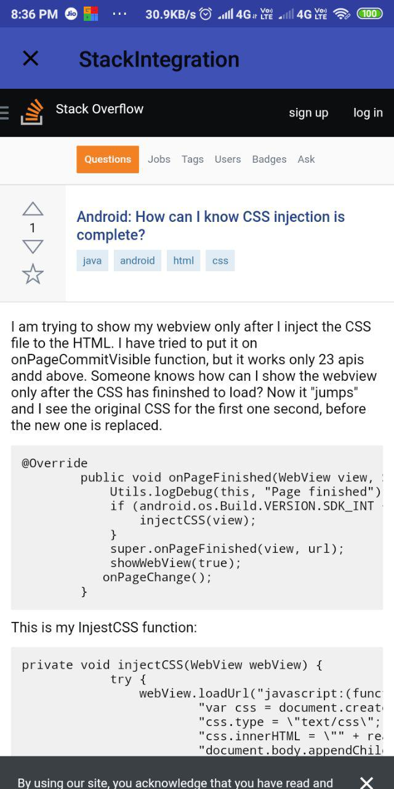

# stackIntegration

* Assignment By Upgrad

## Login Activity(Dummy Login or without using api_authentication )

## Register Activity(Dummy)

## UserInterestActivity(tag not selected yet)

## UserInterestActivity(after tag selection)

## In-app Web(onClick question)

## Your# 

## PopUp Menu (onLongClick question)

## share link

## Share Example For telegram

## Navigation Drawer

